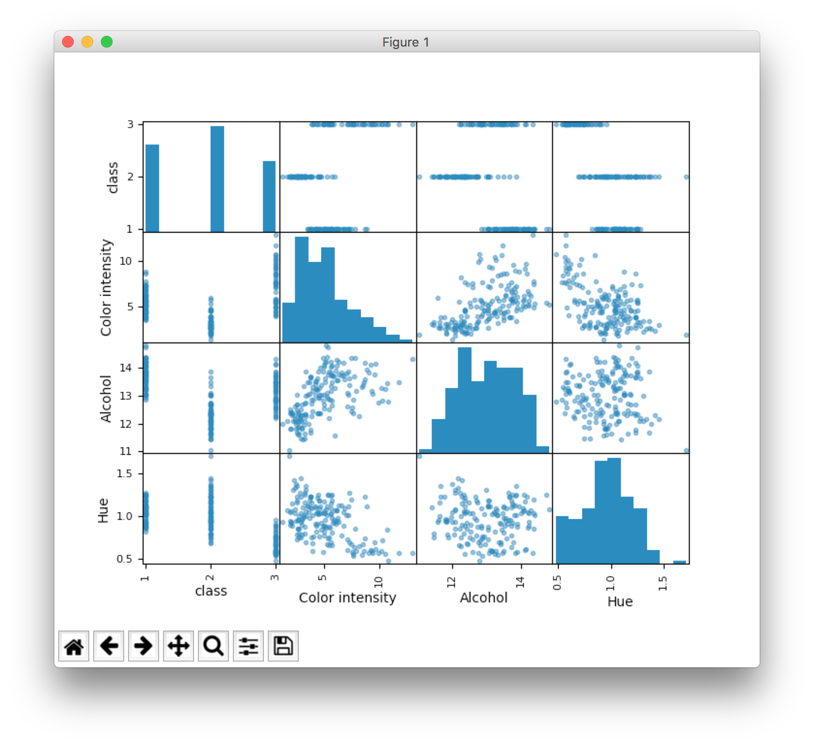

# Module 1

> Tools, frames and data sets, their statistics, preprocessing and simple machine learning.

## Tools [`1_tools.py`](1_tools.py)

To verify that your machine has the _Python_ interpreter installed, just type `python` in the terminal. If everything is normal, you will be given a prompt.

The first script that accompanies this lab imports all the libraries we need and displays them.

```python
import sys
import scipy as sp
import numpy as np
import matplotlib as plt
import pandas as pd
import sklearn as skl

print 'Python: %s' % sys.version
print 'scipy: %s' % sp.__version__
print 'numpy: %s' % np.__version__
print 'matplotlib: %s' % plt.__version__
print 'pandas: %s' % pd.__version__
print 'sklearn: %s' % skl.__version__
```

> **Task 1:** Create your own script, in which you import all the needed libraries and say *Hello* to the world.
## Data frames [`2_data_frame.py`](2_data_frame.py)

Short introduction to _Python_ language:


- this language is simple and if you can program in any other language (and most probably you can), you will make it,
- you commen using a dash (`#`),
- you do not need to declare variable types,
- instead of brackets you use indentations (so the meaning is not only the size of the characters, but also the spaces).
- if you do not know something, you know where the [Stack Overflow](https://stackoverflow.com) is.

In this task we create a so-called _data frame_, which is different from the classical array in that each row and each column has its name. We will need the `numpy` and` pandas` libraries.

```python
import numpy as np
import pandas as pd
```

At the beginning we create an array. This is not an ordinary table, but a `numpy` array. Apparently it is not different from this classically declared, but in fact allows us to shorten most of the operation and thanks to it practically nothing we will have to do manually.

```python
array = np.array([[1, 2, 3], [4, 5, 6]])
```

However, we want to prepare our own data frame, and this also includes descriptions for columns and rows. Let's get the lists right.

```python
index = ['first row', 'last row']
columns = ['was', 'is', 'will be']
```

With all the data we need, using the `pandas` library, we create a data frame.

```
dataFrame = pd.DataFrame(array, index=index, columns=columns)
```

> **Task 2:** Display the created data frame on the screen and begin to boast to your friends that you are programming in Python.

## Datasets [`3_dataset.py`](3_dataset.py)

If we conduct scientific experiments, it is usually needed to compare our results with others. Therefore, in most cases, we test our methods using so-called benchmark data. The most commonly used source of such data is [UCIML repository](http://archive.ics.uci.edu/ml/).

For this instruction, the file [`wine.csv`](wine.csv) has been added, containing an example of a typical dataset. You can read more about it [on the repository](http://archive.ics.uci.edu/ml/datasets/Wine). The datasets are mostly available in CSV format. If you do not know what the CSV format is, do not confess it to anybody and check out [in Wikipedia](https://en.wikipedia.org/wiki/Comma-separated_values). In short, it is a table format where all data is written in text, cells are separated by commas, and new rows are followed by carriage return.

For convenience, we load such data sets as _data frames_ before the experiments. As you already know, this form requires the columns and rows described. The description of the line will be in this case the number of the object, so we do not have to worry about it, but the description of the columns we have to complement.

Exemplary, for `wine` dataset:

```python
names = ['class', 'Alcohol', 'Malic acid', 'Ash', 'Alcalinity of ash ', 'Magnesium', 'Total phenols', 'Flavanoids', 'Nonflavanoid phenols', 'Proanthocyanins', 'Color intensity', 'Hue', 'OD280/OD315 of diluted wines', 'Proline']
```

The `pandas` library has built-in CSV reader, so we use it to read our dataset.

```python
data = pd.read_csv('wine.csv', names=names)
```

> **Task 3:** Select one of the datasets from the UCI repository, read its description, and complete your script to load this collection, keeping in mind the names of the columns.

## Descriptive statistics [`4_statistics.py`](4_statistics.py)

Loading the data set to just the beginning of the _great fun_. If we have to deal with its processing, it would be worth knowing more about it. For this we will need descriptive statistics.

For the data frame, we can easily display statistics for each feature using the built-in `pandas` method `describe()`.

```python
description = data.describe()
```

An example of such an operation might look like this:

```
class     Alcohol  Malic acid         Ash  \
count  178.000000  178.000000  178.000000
mean     1.938202   13.000618    2.336348
std      0.775035    0.811827    1.117146
min      1.000000   11.030000    0.740000
25%      1.000000   12.362500    1.602500
50%      2.000000   13.050000    1.865000
75%      3.000000   13.677500    3.082500
max      3.000000   14.830000    5.800000
```

> **Task 4:** Complete your script to display descriptive statistics for the dataset. Using your knowledge of Probability and Statistics, in the comment, explain each of the measures shown.

## Data visualization [`5_scatter_plot.py`](5_scatter_plot.py)

If you do not do well with the interpretation of numbers and descriptive statistics do not tell you a lot, happily there is still hope for you. Numbers also be visualized. To display the loaded file, we will use the `matplotlib` library.

```python
import matplotlib.pyplot as plt
```

Our choice of visualization will be _scatter plot_, brought by helpful `pandas`.

```python
from pandas.tools.plotting import scatter_matrix
```

Note that this time we have not imported the entire module, but only a single function. Let's use it to draw a _scatter plot_.

```python
scatter_matrix(data)
plt.show()
```



> **Task 5:** Browse the documentation of the used libraries to learn how to draw a histogram of one, chosen feature and **do it**.

## Preproccesing[`preprocessing.py`](6_preprocessing.py)

Soon we will be able to make our first experiment. However, before we do, we need to remember how important the process of preprocessing is. As an example, we will use the `sklearn.preprocessing` module.

```python
import sklearn.preprocessing as sklp
```

At the beginning, we need to split the data set into two parts. Features (we call it subset `X`) and labels (subset` Y`). In the case of `wine` dataset, labels were in the first column. Features are the rest of the data set.

```python
array = data.values
X = array[:,1:]
Y = array[:,0]
```

In the next step, we'll rescale a subset of features by making them standardized, which in this case means processing them so that the average value is zero and the standard deviation is one.

```python
scaler = sklp.StandardScaler().fit(X)
rescaledX = scaler.transform(X)
```

Let's compare the original and standardized set of features.

>X
```
[[  14.23    1.71    2.43   15.6   127.  ]
 [  13.2     1.78    2.14   11.2   100.  ]
 [  13.16    2.36    2.67   18.6   101.  ]
 [  14.37    1.95    2.5    16.8   113.  ]
 [  13.24    2.59    2.87   21.    118.  ]]
```

> rescaledX
```
[[ 1.519 -0.562  0.232 -1.17   1.914]
 [ 0.246 -0.499 -0.828 -2.491  0.018]
 [ 0.197  0.021  1.109 -0.269  0.088]
 [ 1.692 -0.347  0.488 -0.809  0.931]
 [ 0.296  0.228  1.84   0.452  1.282]]
```

## Teaching

```python
from sklearn import neighbors
```

```python
from sklearn.model_selection import cross_val_score
```

```python
clf = neighbors.KNeighborsClassifier()
```

```python
clf.fit(X, Y)
scores = cross_val_score(clf, X, Y, cv=10)
print 'Acc: %.3f' % scores.mean()
```

> **Task 6:** Complete your script with the learning process. Test at least three classifiers and show the results you have achieved. Also verify the quality of the classification on the standardized set X.
